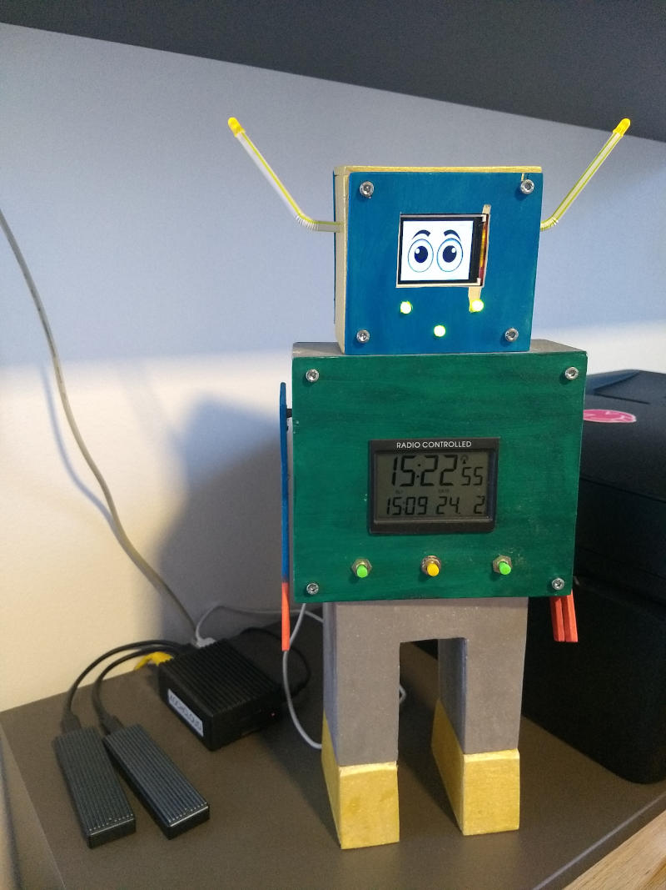

# Kochcloud of Things

## Overview

Arduino / ESP8266 based IoT toy project: simple sensor devices which publish their data via ESPNow and MQTT to the Kochcloud [OpenHAB](https://www.openhab.org/) server.

Each sensor device uses [ESPNow](https://www.espressif.com/en/products/software/esp-now/overview) to send its measurements to the Gateway Robot, which acts as gateway between the devices and the MQTT server.
ESPNow is used because is more energy efficient and covers a longer distance compared with directly connecting to the home WiFi from the sensor device.

The code is not polished in any way and is a messy mix of C/C++ styles cobbled together by a Java programmer.
Please don't take it as a reference.

## Projects

<figcaption>The Gateway Robot standing next to the Kochcloud.</figcaption>

### gateway-robot

The ESP8266 Gateway Robot acts as the gateway between the sensor devices and the MQTT server which is used to publish the data to OpenHAB.
It receives ESPNow messages from the devices, maps them to Protobuf messages in a format shared with the robot-gateway and writes them on USB/Serial.

### robot-gateway

The counterpart of the Gateway Robot running on a Raspberry PI 4.
Reads the Protobuf messages from the Gateway Robot over USB/Serial and publishes them to the MQTT server.
The MQTT message body is the content of the Protobuf message, converted to JSON using the standard Protobuf-to-JSON mapping.
The robot-gateway also subscribes to MQTT messages intended for the gateway-robot.
It converts them to Protobuf and writes them on USB/Serial.

### stromzaehler

Reads power meter data using infrared sensors from the SML/DSS port of the meter.

### zisternensensor

Read the fill level of our cistern using a distance sensor and also ambient temperature/humidity/air pressure.

## Build Environment

[Platformio](https://platformio.org/) using the Arduino framework.

## Status

Publishing messages from stromzaehler and zisternensensor via Gateway Robot/Robot Gateway to MQTT is working.

The robot-gateway display and LEDs can be controlled from OpenHAB via MQTT messages.

The display can also show the indoor and outdoor temperature.
It is controlled by messages from the home automation.